Youtube
1.	Download Zip file and Exctract (project-master.zip) , when extracting using windows ZIP extraction option it will create a folder within a folder pay attention to open the app's folder and not the occupying folder
2.	Download and open android studio
3.	Press “Open” to open the project 
4.	Choose the project’s folder (make sure you see an android icon) .
     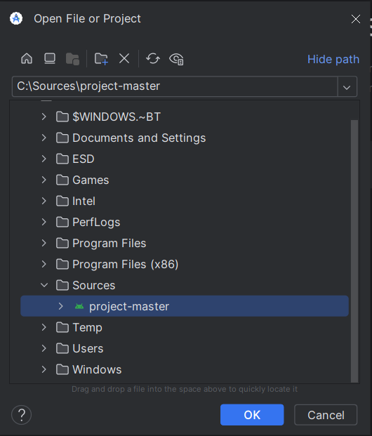
 
6.	Run the project (if it this button doesn’t appear continue reading the guide)
      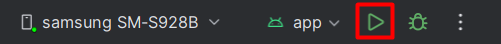
 
8.	The Project will start loading and a few notifications will pop up, press “Automatically” under microosft defender notification.
    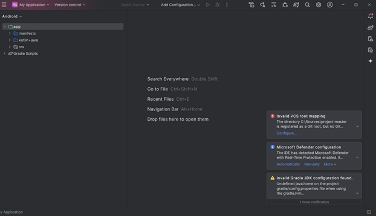
  	
10.	Press “Add Configuration” and “edit Confiduration”
       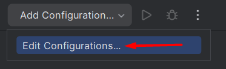
   	
12.	A windows will open, press “Add new run configuration”
       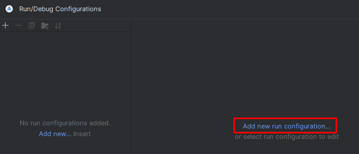
   	
14.	Choose “Android App”
       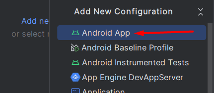
   	
16.	Under “Module” choose “My_Application.app.main”
       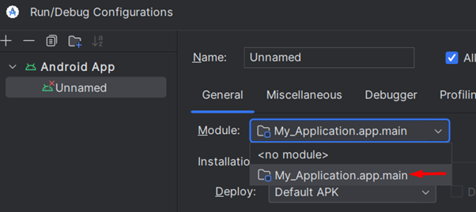
   	
18.	Under “Lunch option” change to “Specified Activity”
       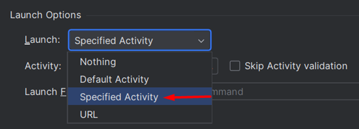
   	
20.	Press on the “Search”
       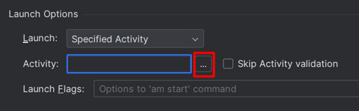
   	
and choose the option “Homescreen” and press ok and ok again.
    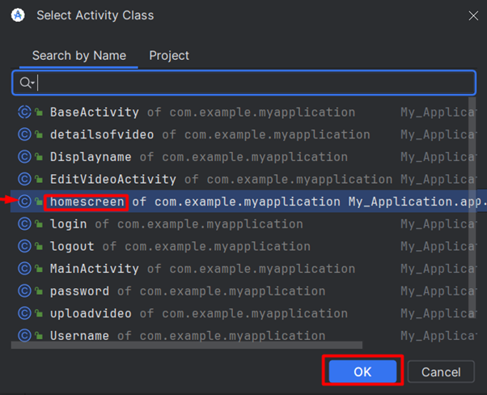
    
22.	Try and run the project
       
   	
A massege like that might pop up
   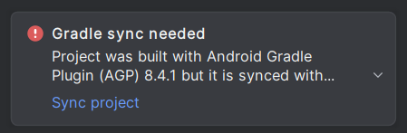
   
press “Sync Project” and try to run again, the app will be installed on your device and run.
